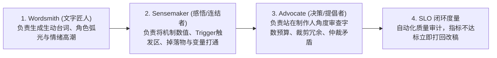

# 游戏叙事与剧情工业化设计框架 (Game Narrative Pedagogy & Engineering)

> **最高指导法则**：  
> **“写作不仅需要创意，它是一个充斥着大量细节的持续迭代过程。游戏叙事绝不是穿着毛衣在湖边独自写长篇小说，而是必须与游戏系统机制（Mechanics & Dynamics）深度咬合，并建立客观量化的 SLO 质量闭环！”** —— 赛斯·哈德森（Seth Hudson，GDC 演讲人、乔治梅森大学教授）

---

## 🎯 一、 核心痛点与 Agent 常见盲区诊断

传统 Agent 在生成游戏剧情与文本时，极易陷入以下三大致命误区：
1. **孤立作家病 (Isolated Writer Syndrome)**：
   - 吐出几千字的世界观玄幻背景设定，但没有任何一个设定能转化为游戏中的关卡、NPC 对话选项、掉落物品或状态机变量。
2. **单轮生成病 (Single-Shot Mirage)**：
   - 误以为“给出一个 Prompt ➔ 生成一段对话 ➔ 直接填入代码”就算完成，完全缺失“草稿 (Drafting) ➔ 跨工种反馈 (Feedback Loop) ➔ 评审工作坊 (Workshop) ➔ 针对性残酷改稿”的真实流程。
3. **系统脱节病 (Mechanics Disconnect)**：
   - 台词纯文字堆砌，不包含任何变量插值、状态分支判断、触发区前置条件（Prerequisites）或关卡机制指引，玩家读了半天不知道该去哪里、做什么。

---

## 🏛️ 二、 五大基础能力领域 (5 Functional Competencies / Fun-Comps)

在为任何游戏设计剧情、任务与台词时，Agent 必须强制检查以下 5 个维度：

| 能力领域 | 核心标准 | Agent 行为准则 |
| :--- | :--- | :--- |
| **1. 写作与叙事技艺** *(Writing & Narrative Craft)* | 细节迭代与严格标准 | 严禁单轮输出交付。必须经历“草稿 ➔ 多视角审阅 ➔ 润色剪裁”至少两轮流转。严格控制单屏字数（移动端/微信单句 $\le 45$ 字，PC 对白 $\le 80$ 字），保证角色弧光与性格鲜明。 |
| **2. 沟通与跨工种协作** *(Communication & Collaboration)* | 同理心与团队咬合 | 站在程序、美术、关卡策划角度思考。为每条台词标明触发事件、动画表情需求、音效配合标记（如 `[SFX: metal_clank]`）与镜头聚焦建议。 |
| **3. 游戏系统与动力学咬合** *(Game Systems & Dynamics)* | 机制即叙事 (Ludonarrative) | 杜绝纯虚词。对白必须直接挂钩核心玩法：引导探索（提及地标）、解释机制（如“火系攻击会引燃油桶”）、消耗资源、更新任务状态。写对白的同时必须编写配套的 UI 提示与系统文案。 |
| **4. 工具敏捷与自愈力** *(Tool Fluency & Agility)* | 结构化输出与容错 | 熟悉并采用 JSON/YAML/DSL 标准结构组织剧情节点。面对不完备或冲突需求时，自主查缺补漏，生成合法合规的 DAG 节点，杜绝断头分支。 |
| **5. 玩家心智与心流共情** *(Understanding Games & Players)* | 从消费者跃迁为工业创造者 | 调研同类品类玩家的先验知识模型（如魂系碎片叙事、爬塔意图短文本、二游角色好感互动）。根据心流阶段动态分配叙事密度：紧张战斗期给短指令，休整探索期给剧情细节。 |

---

## 🎭 三、 三大必要角色人格流水线 (3 Essential Roles Pipeline)

在执行叙事生成任务时，Agent 必须在内部模拟或分阶段扮演以下三大人格：

1. **文字匠人 (Wordsmith / Craftsperson)**：
   - 任务：雕琢语言风格（冷酷、俏皮、史诗、科技感），塑造生动的角色对白与内心冲突。
2. **感悟者 / 连结者 (Sensemaker / Synthesizer)**：
   - 任务：在系统机制与剧情故事之间架设桥梁。检查每个剧情节点是否挂载了游戏变量（如 `{player_gold}`、`{quest_stage}`），是否正确引用了物品名称与地点坐标。
3. **提倡者 / 决策者 (Advocate / Facilitator)**：
   - 任务：进行残酷的“删繁就简”。判断这句台词是否拖慢游戏节奏？玩家是否会狂点 Skip 跳过？如果是，果断压缩 50% 篇幅，“挑个你的菜”，适时做出工程妥协。

---

## 📊 四、 工业级叙事 SLO 质量度量标准 (Narrative Service Level Objectives)

每个剧情包必须通过以下 4 项 SLO 硬性指标审计：

1. **DAG 连通率 (Reachability & Dead-End Ratio = 0%)**：
   - 剧情图中除了标记为 `END` 或 `BRANCH_EXIT` 的终局节点外，不得存在无后续指向的死路孤岛节点。
2. **机制咬合密度 (Mechanic Hook Density $\ge 30\%$)**：
   - 全篇对话节点中，至少有 30% 以上的节点实际读取或变更了游戏状态（金币、好感度、装备、解锁区域、关卡触发器）。
3. **节奏字数合规率 (Word Budget Compliance = 100%)**：
   - 单段对白字数必须处于安全阈值内（移动端 $\le 75$ 字），避免遮挡视口核心区域。
4. **情感张力起伏度 (Tension Variance $> 0.25$)**：
   - 剧情不得是平铺直叙的流水账，必须在“平缓介绍 ➔ 危机冲突 ➔ 抉择转折 ➔ 情绪释放”之间形成波形振荡。
